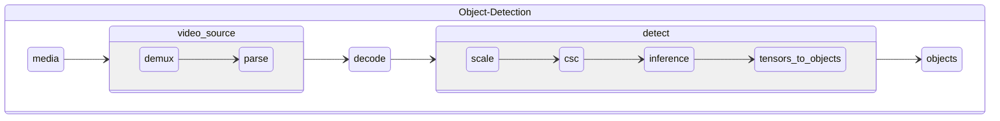

# Intel® Deep Learning Streamer (Intel® DL Streamer) Pipeline Zoo
| [Getting Started](#getting-started)
| [Tasks and Pipelines](docs/tasks-and-pipelines.md)
| [Measurement Definitions](docs/measurements.md)
| [Intel® Core™ processor Examples](docs/core.md)
| [Intel® Xeon® Processor Examples](docs/xeon.md)
| [Intel® Data Center GPU Flex Series 140 Examples](docs/flex_140_gpu.md)
| [Intel® Data Center GPU Flex Series 170 Examples](docs/flex_170_gpu.md)
| [Pick and Go Use Case](docs/pick-and-go.md)
| [Advanced Examples](docs/examples.md)
| [Pipebench Reference](docs/pipebench-reference-guide.md)
| [Measurement Output](docs/output.md) |

**Important note:

This repository is archived and no longer supported**


The Intel® DL Streamer Pipeline Zoo is a catalog of media and media analytics
pipelines optimized for Intel hardware. It includes tools for
downloading pipelines and their dependencies and tools for measuring
their performance.

Pipelines are organized according to the task they perform (what types
of input they accept and what types of output they generate). Tasks
and pipelines are defined in a platform and framework independent way
to allow implementations in a variety of frameworks and for multiple
platform targets.



## Features Include:
| |                  |
|---------------------------------------------|------------------|
| **Simple command line interface** | A single entrypoint for downloading and running media analytics pipelines along with media and model dependencies |
| **Intel® DL Streamer Pipeline Runner**| Pipeline implementations and optimizations using the Intel® Deep Learning Streamer Pipeline Framework |
| **Platform specific settings**| Pipeline runner settings tuned for optimal performance on different platform types (e.g. Intel® Core™ processorcore, Intel® Xeon® Processor) |
| **Measurement Settings** | Settings for measuring different scenarios including single stream throughput and stream density. Settings can be customized and saved for reuse.|
| **Containerized environment** | Dockerfiles, build and run scripts for launching a reproducable environment |

> **IMPORTANT:**
>
> The Pipeline Zoo is provided as a set of tools for system evaluation
> and benchmarking and is not intended for deployment into production environments
> without modification.
>
> The project is pre-production and under active development. Please expect breaking changes and use tagged versions for stable functionality.


# Getting Started

## Prerequisites

| |                  |
|---------------------------------------------|------------------|
| **Docker** | The Pipeline Zoo requires Docker for it's build, development, and runtime environments. Please install the latest [version](https://docs.docker.com/install) for your platform.|
| **bash** | The Pipeline Zoo build and run scripts require bash and have been tested on systems using versions greater than or equal to: `GNU bash, version 4.3.48(1)-release (x86_64-pc-linux-gnu)`.  |

## Installation
1. Clone Repository
   ```
   git clone https://github.com/dlstreamer/pipeline-zoo.git pipeline-zoo
   ```
2. Build Pipeline Zoo Environment
   ```
   ./pipeline-zoo/tools/docker/build.sh
   ```
   Output:
   ```
   Successfully built 113352079483
   Successfully tagged media-analytics-pipeline-zoo-bench:latest
   ```
3. Launch Pipeline Zoo
   ```
   ./pipeline-zoo/tools/docker/run.sh
   ```
## Pipline Zoo Commands
### List Pipelines
   Command:
   ```
   pipebench list
   ```
   Output:
   ```
+--------------------------------------------+-----------------------+----------------------------+------------+
| Pipeline                                   | Task                  | Models                     | Runners    |
+============================================+=======================+============================+============+
| decode-h265                                | decode-vpp            |                            | dlstreamer |
|                                            |                       |                            | mockrun    |
+--------------------------------------------+-----------------------+----------------------------+------------+
| decode-h264-bgra                           | decode-vpp            |                            | dlstreamer |
|                                            |                       |                            | mockrun    |
+--------------------------------------------+-----------------------+----------------------------+------------+
| od-h265-ssd-mobilenet-v1-coco              | object-detection      | ssd_mobilenet_v1_coco_INT8 | dlstreamer |
+--------------------------------------------+-----------------------+----------------------------+------------+
| od-h264-ssd-mobilenet-v1-coco              | object-detection      | ssd_mobilenet_v1_coco      | dlstreamer |
|                                            |                       |                            | mockrun    |
+--------------------------------------------+-----------------------+----------------------------+------------+
| oc-h265-full_frame-resnet-50-tf            | object-classification | full_frame                 | dlstreamer |
|                                            |                       | resnet-50-tf               | mockrun    |
+--------------------------------------------+-----------------------+----------------------------+------------+
| oc-h264-full_frame-resnet-50-tf            | object-classification | full_frame                 | dlstreamer |
|                                            |                       | resnet-50-tf               | mockrun    |
+--------------------------------------------+-----------------------+----------------------------+------------+
| oc-h264-ssd-mobilenet-v1-coco-resnet-50-tf | object-classification | ssd_mobilenet_v1_coco      | dlstreamer |
|                                            |                       | resnet-50-tf               | mockrun    |
+--------------------------------------------+-----------------------+----------------------------+------------+
| oc-h265-ssd-mobilenet-v1-coco-resnet-50-tf | object-classification | ssd_mobilenet_v1_coco      | dlstreamer |
|                                            |                       | resnet-50-tf               | mockrun    |
+--------------------------------------------+-----------------------+----------------------------+------------+
   ```

### Download Pipeline

   Command:
   ```
   pipebench download od-h264-ssd-mobilenet-v1-coco
   ```
   Example Output Tree:
   ```
- pipeline-zoo/
  + doc/
  + media/
  + models/
  + pipelines/
  + runners/
  + tools/
  - workspace/
    - od-h264-ssd-mobilenet-v1-coco/
      - media/
        - video/
          + Pexels-Videos-1388365/
          + person-bicycle-car-detection/
      - models/
        - ssd_mobilenet_v1_coco/
          + FP16/
          + FP32/
          + ssd_mobilenet_v1_coco_2018_01_28/
        - ssd_mobilenet_v1_coco_INT8/
          + FP16-INT8/
      - runners/
        + dlstreamer/
        + mockrun/
      README.md
      dlstreamer.core.runner-settings.yml
      dlstreamer.density.core.runner-settings.yml
      dlstreamer.density.dgpu.runner-settings.yml
      dlstreamer.density.runner-settings.yml
      dlstreamer.density.xeon.runner-settings.yml
      dlstreamer.dgpu.runner-settings.yml
      dlstreamer.runner-settings.yml
      dlstreamer.xeon.runner-settings.yml
      media.list.yml
      mockrun.runner-settings.yml
      models.list.yml
      od-h264-ssd-mobilenet-v1-coco.pipeline.yml
   ```

### Measure Single Stream Throughput

Command:

 ```
 pipebench run od-h264-ssd-mobilenet-v1-coco
 ```

Example Output:

```
 Pipeline:
	od-h264-ssd-mobilenet-v1-coco

 Runner:
	dlstreamer
 	dlstreamer.runner-settings.yml

 Media:
	video/person-bicycle-car-detection

 Measurement:
	throughput
 	throughput.measurement-settings.yml

 Output Directory:
	/home/pipeline-zoo/workspace/od-h264-ssd-mobilenet-v1-coco/measurements/throughput/dlstreamer/run-0000

========================================================================
Iteration   Streams  Processes    Minimum   Average   Maximum      Total
========================================================================
     0000      0000       0001     0.0000    0.0000    0.0000     0.0000
========================================================================

========================================================================
Iteration   Streams  Processes    Minimum   Average   Maximum      Total
========================================================================
     0000      0001       0001   130.3469  130.3469  130.3469   130.3469
========================================================================

========================================================================
Iteration   Streams  Processes    Minimum   Average   Maximum      Total
========================================================================
     0000      0001       0001   128.9403  128.9403  128.9403   128.9403
========================================================================

========================================================================
Iteration   Streams  Processes    Minimum   Average   Maximum      Total
========================================================================
     0000      0001       0001   129.5578  129.5578  129.5578   129.5578
========================================================================

...
<SNIP>
...

========================================================================
Iteration   Streams  Processes    Minimum   Average   Maximum      Total
========================================================================
     0000      0001       0001   126.2640  126.2640  126.2640   126.2640
========================================================================

========================================================================
Iteration   Streams  Processes    Minimum   Average   Maximum      Total
========================================================================
     0000      0001       0001   125.8236  125.8236  125.8236   125.8236
========================================================================

Pipeline                       Runner      Streams: 1
-----------------------------  ----------  ---------------------------------------------------------
od-h264-ssd-mobilenet-v1-coco  dlstreamer  Min: 125.8236 Max: 125.8236 Avg: 125.8236 Total: 125.8236

```

### Measure Stream Density

Command:
```
 pipebench run --measure density od-h264-ssd-mobilenet-v1-coco
```

Example Output:

```
 Pipeline:
	od-h264-ssd-mobilenet-v1-coco

 Runner:
	dlstreamer
 	dlstreamer.density.runner-settings.yml

 Media:
	video/person-bicycle-car-detection

 Measurement:
	density
 	density.measurement-settings.yml

 Output Directory:
	/home/pipeline-zoo/workspace/od-h264-ssd-mobilenet-v1-coco/measurements/density/dlstreamer/run-0000

========================================================================
Iteration   Streams  Processes    Minimum   Average   Maximum      Total
========================================================================
      PRE      0001       0001   121.7170  121.7170  121.7170   121.7170
========================================================================

========================================================================
Iteration   Streams  Processes    Minimum   Average   Maximum      Total
========================================================================
      PRE      0001       0001   128.3342  128.3342  128.3342   128.3342
========================================================================

...
<SNIP>
...

========================================================================
Iteration   Streams  Processes    Minimum   Average   Maximum      Total
========================================================================
     0001      0003       0003    30.0000   30.0038   30.0110    90.0115
========================================================================

========================================================================
Iteration   Streams  Processes    Minimum   Average   Maximum      Total
========================================================================
     0001      0003       0003    29.9868   29.9959   30.0115    89.9878
========================================================================

Pipeline                       Runner      Streams: 4                                              Streams: 3
-----------------------------  ----------  ------------------------------------------------------  -----------------------------------------------------
od-h264-ssd-mobilenet-v1-coco  dlstreamer  Min: 28.4167 Max: 28.5507 Avg: 28.4844 Total: 113.9374  Min: 29.9868 Max: 30.0115 Avg: 29.9959 Total: 89.9878

```

### Measure Latency

Command:
```
 pipebench run --measure latency od-h264-ssd-mobilenet-v1-coco
```

Example Output:
- Latency: Pipeline(s) latency in ms
- Avg: Average frame latency in ms
- Min: Minimum frame latency in ms
- Max: Maximum frame latency in ms
- Element: Name of the element

```
 Pipeline:
        od-h264-ssd-mobilenet-v1-coco

 Runner:
        dlstreamer
        dlstreamer.runner-settings.yml

 Media:
        video/person-bicycle-car-detection

 Measurement:
        latency
        latency.measurement-settings.yml

 Output Directory:
        /home/pipeline-zoo/workspace/od-h264-ssd-mobilenet-v1-coco/measurements/latency/dlstreamer/run-0000


==========================================================================================================================================================================
Latency file /home/pipeline-zoo/workspace/od-h264-ssd-mobilenet-v1-coco/measurements/latency/dlstreamer.dgpu/run-0010/iteration-0000/process-0000-stream-0000/latency.log

==========================================================================================================================================================================

...
<SNIP>
...

========================================================================
Iteration   Streams  Processes    Minimum   Average   Maximum      Total
========================================================================
     0000      0001       0001   785.5227  785.5227  785.5227   785.5227
========================================================================


Stream(s) Latency:
|   Latency |     Avg |     Min |     Max |
|-----------|---------|---------|---------|
|    1.4887 | 312.412 | 111.941 | 924.974 |


Elements Latency
| Element         | Avg     | Min     | Max     |
|-----------------|---------|---------|---------|
| gvafpscounter0  | 0.0055  | 0.0031  | 0.0749  |
| gvametapublish0 | 0.0066  | 0.003   | 0.4028  |
| gvametaconvert0 | 0.0139  | 0.005   | 0.5634  |
| detect0         | 303.822 | 110.071 | 386.337 |
| capsfilter1     | 0.0127  | 0.0056  | 0.206   |
| decode0         | 8.5007  | 0.5822  | 796.253 |
| capsfilter0     | 0.0084  | 0.0036  | 0.6213  |
| h264parse0      | 0.0342  | 0.0101  | 0.655   |
| qtdemux0        | 0.0015  | 0.0004  | 0.0251  |


Pipeline                       Runner      Streams: 1
-----------------------------  ----------  ---------------------------------------------------------
od-h264-ssd-mobilenet-v1-coco  dlstreamer  Min: 785.5227 Max: 785.5227 Avg: 785.5227 Total: 785.5227
```

