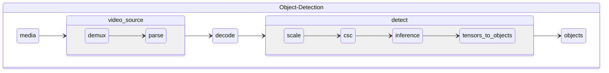
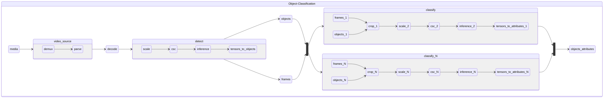

# Intel® Data Center GPU Flex Series 140 Guide
| [Installation](#installation) | [Object Detection](#object-detection-pipelines) | [Object Classification](#object-classification-pipelines) |

> **Note:**
> These instructions assume that your host environment and firmware have already been installed.
>
> Actual results will vary based on configuration and the examples below are for illustration purposes only.

> **Note:** For best results enable performance mode for the CPU.
> ```
> echo performance | sudo tee /sys/devices/system/cpu/cpu*/cpufreq/scaling_governor
> ```

## Installation

Use the following commands to enable discrete graphics support.

1. Clone Repository
   ```
   git clone https://github.com/dlstreamer/pipeline-zoo.git pipeline-zoo
   ```
2. Build Pipeline Zoo Environment
   ```
   ./pipeline-zoo/tools/docker/build.sh --platform dgpu
   ```
   #### Expected Output
   
   ```
   Removing intermediate container d186e3cdb2e6
   ---> 84423666f6d7
   Successfully built 84423666f6d7
   Successfully tagged dlstreamer-pipeline-zoo-dgpu:latest
   ```
   
   > **Note:**
   > If you need to use a different base image (for example with updated drivers or local modifications) pass the image via the `--base` argument.
   >
   > ```bash
   > ./pipeline-zoo/tools/docker/build.sh --platform dgpu --base <IMAGE_NAME_HERE>
   >  ```

   
3. Launch Pipeline Zoo
   ```
   ./pipeline-zoo/tools/docker/run.sh --platform dgpu
   ```
   #### Expected Output
   ```
   Running Media Analytics Pipeline Zoo Image: 'dlstreamer-pipeline-zoo-dgpu'
      Environment: '-e no_proxy -e https_proxy -e http_proxy -e DISPLAY  -e DEVICE=/dev/dri/renderD128'
      Volume Mounts: '-v /home/gta/.netrc:/root/.netrc -v /home/pipeline-zoo:/home/pipeline-zoo/ -v /tmp:/tmp -v /var/tmp:/var/tmp -v /dev:/dev -v /lib/modules:/lib/modules -v /home/gta/.Xauthority:/root/.Xauthority '
      Name: 'dlstreamer-pipeline-zoo-dgpu'
   ...
   ```

## Object Detection Pipelines

```
+----------------------------------------------+-----------------------+----------------------------+------------+
| Pipeline                                     | Task                  | Models                     | Runners    |
+==============================================+=======================+============================+============+
| od-h264-yolov5s-416                          | object-detection      | yolov5s-416                | mockrun    |
|                                              |                       |                            | dlstreamer |
+----------------------------------------------+-----------------------+----------------------------+------------+
| od-h264-ssd-mobilenet-v1-coco                | object-detection      | ssd_mobilenet_v1_coco      | mockrun    |
|                                              |                       |                            | dlstreamer |
+----------------------------------------------+-----------------------+----------------------------+------------+
| od-h264-yolo-v4-tf                           | object-detection      | yolo-v4-tf                 | mockrun    |
|                                              |                       |                            | dlstreamer |
+----------------------------------------------+-----------------------+----------------------------+------------+
| od-h265-ssd-mobilenet-v1-coco                | object-detection      | ssd_mobilenet_v1_coco_INT8 | dlstreamer |
+----------------------------------------------+-----------------------+----------------------------+------------+
| od-h265-ssdlite-mobilenet-v2                 | object-detection      | ssdlite_mobilenet_v2       | mockrun    |
|                                              |                       |                            | dlstreamer |
+----------------------------------------------+-----------------------+----------------------------+------------+
| od-h265-yolo-v4-tf                           | object-detection      | yolo-v4-tf                 | mockrun    |
|                                              |                       |                            | dlstreamer |
+----------------------------------------------+-----------------------+----------------------------+------------+
| od-h264-yolo-v4-tf-416                       | object-detection      | yolo-v4-tf-416_INT8        | mockrun    |
|                                              |                       |                            | dlstreamer |
+----------------------------------------------+-----------------------+----------------------------+------------+
| od-h265-yolo-v4-tf-416                       | object-detection      | yolo-v4-tf-416_INT8        | mockrun    |
|                                              |                       |                            | dlstreamer |
+----------------------------------------------+-----------------------+----------------------------+------------+
| od-h264-ssdlite-mobilenet-v2                 | object-detection      | ssdlite_mobilenet_v2       | mockrun    |
|                                              |                       |                            | dlstreamer |
+----------------------------------------------+-----------------------+----------------------------+------------+
```
### Downloading an Object Detection Pipeline

Using the pipebench tool you can download the object detection pipeline and its accompanying models and sample media.

```bash
pipebench download od-h265-ssd-mobilenet-v1-coco
```
#### Expected Output
```bash
=========================================
Downloading od-h265-ssd-mobilenet-v1-coco
=========================================


===================
Downloading Runners
===================

Download dlstreamer
Building: ⠋
=================
Downloading Media
=================

Downloading: Pexels-Videos-1388365.temp
100%|███████████████████████████████████████████████████████████████████████████████████████████████████████████████████████████████████████████████████████| 44.4M/44.4M [00:01<00:00, 41.0MiB/s]
        FFMPEG Converting
Converting: ⠙
==================
Downloading Models
==================

Download: ssd_mobilenet_v1_coco_INT8
Loading: ⠴
Pipeline Downloaded
```

## Measuring Throughput

The following command reports total throughput running 1 stream on each graphics device (1 process per graphics device, 2 total processes, 2 total streams).

```bash
pipebench run od-h265-ssd-mobilenet-v1-coco --platform dgpu --streams 2 --media video/Pexels-Videos-1388365-h265 --duration 300
```
#### Expected Output

```
Pipeline:
	od-h265-ssd-mobilenet-v1-coco

 Runner:
	dlstreamer
 	dlstreamer.dgpu.runner-settings.yml

 Media:
	video/Pexels-Videos-1388365-h265

 Measurement:
	throughput
 	throughput.measurement-settings.yml

 Output Directory:
	/home/pipeline-zoo/workspace/od-h265-ssd-mobilenet-v1-coco/measurements/throughput/dlstreamer.dgpu/run-0001

========================================================================
Iteration   Streams  Processes    Minimum   Average   Maximum      Total
========================================================================
     0000      0000       0002     0.0000    0.0000    0.0000     0.0000
========================================================================
<SNIP>
========================================================================
Iteration   Streams  Processes    Minimum   Average   Maximum      Total
========================================================================
     0000      0002       0002   969.3024  969.3440  969.3857  1938.6881
======================================================================== 

========================================================================
Iteration   Streams  Processes    Minimum   Average   Maximum      Total
========================================================================
     0000      0002       0002   970.6380  970.7773  970.9167  1941.5547
======================================================================== 

Pipeline                       Runner      Streams: 2
-----------------------------  ----------  ----------------------------------------------------------
od-h265-ssd-mobilenet-v1-coco  dlstreamer  Min: 970.6380 Max: 970.9167 Avg: 970.7773 Total: 1941.5547
```
## Measuring Stream Density

The following command measures stream density using 8 streams on each graphics device (1 process per graphics device, 2 total processes, 16 total streams).

```bash
timeout 300 pipebench run --measure density --platform dgpu od-h265-ssd-mobilenet-v1-coco --no-numactl --duration 500 --streams 16 --streams-per-process 8
```

#### Expected Output

```
 Pipeline:
	od-h265-ssd-mobilenet-v1-coco

 Runner:
	dlstreamer
 	dlstreamer.density.dgpu.runner-settings.yml

 Media:
	video/Pexels-Videos-1388365-h265

 Measurement:
	density
 	density.measurement-settings.yml

 Output Directory:
	/home/pipeline-zoo/workspace/od-h265-ssd-mobilenet-v1-coco/measurements/density/dlstreamer.dgpu/run-0004

========================================================================
Iteration   Streams  Processes    Minimum   Average   Maximum      Total
========================================================================
     0000      0000       0002     0.0000    0.0000    0.0000     0.0000
======================================================================== 

========================================================================
Iteration   Streams  Processes    Minimum   Average   Maximum      Total
========================================================================
     0000      0000       0002     0.0000    0.0000    0.0000     0.0000
======================================================================== 
<SNIP>
========================================================================
Iteration   Streams  Processes    Minimum   Average   Maximum      Total
========================================================================
     0000      0016       0002   111.6087  114.7230  118.2333  1835.5678
======================================================================== 

Pipeline                       Runner      Streams: 16
-----------------------------  ----------  ----------------------------------------------------------
od-h265-ssd-mobilenet-v1-coco  dlstreamer  Min: 111.6087 Max: 118.2333 Avg: 114.7230 Total: 1835.5678
```

## Object Classification Pipelines


```
+----------------------------------------------+-----------------------+----------------------------+------------+
| Pipeline                                     | Task                  | Models                     | Runners    |
+==============================================+=======================+============================+============+
| oc-h264-full_frame-efficientnet-b0           | object-classification | full_frame                 | mockrun    |
|                                              |                       | efficientnet-b0            | dlstreamer |
+----------------------------------------------+-----------------------+----------------------------+------------+
| oc-h265-ssdlite-mobilenet-v2-efficientnet-b0 | object-classification | ssdlite_mobilenet_v2       | mockrun    |
|                                              |                       | efficientnet-b0            | dlstreamer |
+----------------------------------------------+-----------------------+----------------------------+------------+
| oc-h264-yolov5s-416-efficientnet-b0          | object-classification | yolov5s-416                | mockrun    |
|                                              |                       | efficientnet-b0            | dlstreamer |
+----------------------------------------------+-----------------------+----------------------------+------------+
| oc-h264-ssdlite-mobilenet-v2-efficientnet-b0 | object-classification | ssdlite_mobilenet_v2       | mockrun    |
|                                              |                       | efficientnet-b0            | dlstreamer |
+----------------------------------------------+-----------------------+----------------------------+------------+
| oc-h265-full_frame-efficientnet-b0           | object-classification | full_frame                 | mockrun    |
|                                              |                       | efficientnet-b0            | dlstreamer |
+----------------------------------------------+-----------------------+----------------------------+------------+
| oc-h265-yolo-v4-tf-resnet-50-tf              | object-classification | yolo-v4-tf                 | mockrun    |
|                                              |                       | resnet-50-tf               | dlstreamer |
+----------------------------------------------+-----------------------+----------------------------+------------+
| oc-h264-full_frame-resnet-50-tf              | object-classification | full_frame                 | mockrun    |
|                                              |                       | resnet-50-tf               | dlstreamer |
+----------------------------------------------+-----------------------+----------------------------+------------+
| oc-h265-full_frame-resnet-50-tf              | object-classification | full_frame                 | mockrun    |
|                                              |                       | resnet-50-tf               | dlstreamer |
+----------------------------------------------+-----------------------+----------------------------+------------+
| oc-h264-ssd-mobilenet-v1-coco-resnet-50-tf   | object-classification | ssd_mobilenet_v1_coco      | mockrun    |
|                                              |                       | resnet-50-tf               | dlstreamer |
+----------------------------------------------+-----------------------+----------------------------+------------+
| oc-h265-yolo-v4-tf-416-resnet-50-tf          | object-classification | yolo-v4-tf-416_INT8        | mockrun    |
|                                              |                       | resnet-50-tf               | dlstreamer |
+----------------------------------------------+-----------------------+----------------------------+------------+
| oc-h264-yolo-v4-tf-resnet-50-tf              | object-classification | yolo-v4-tf                 | mockrun    |
|                                              |                       | resnet-50-tf               | dlstreamer |
+----------------------------------------------+-----------------------+----------------------------+------------+
| oc-h264-yolo-v4-tf-416-resnet-50-tf          | object-classification | yolo-v4-tf-416_INT8        | mockrun    |
|                                              |                       | resnet-50-tf               | dlstreamer |
+----------------------------------------------+-----------------------+----------------------------+------------+
| oc-h265-ssd-mobilenet-v1-coco-resnet-50-tf   | object-classification | ssd_mobilenet_v1_coco      | mockrun    |
|                                              |                       | resnet-50-tf               | dlstreamer |
+----------------------------------------------+-----------------------+----------------------------+------------+
```
### Downloading an Object Classification Pipeline

Using the pipebench tool you can download an object classification pipeline and its accompanying models and sample media.

```bash
pipebench download oc-h265-ssd-mobilenet-v1-coco-resnet-50-tf
```

#### Expected Output

```bash
======================================================
Downloading oc-h265-ssd-mobilenet-v1-coco-resnet-50-tf
======================================================


===================
Downloading Runners
===================

Download mockrun
Download dlstreamer
Building: ⠋
=================
Downloading Media
=================

Downloading: Pexels-Videos-1388365.temp
100%|███████████████████████████████████████████████████████████████████████████████████████████████████████████████████████████████████████████████████████| 44.4M/44.4M [00:00<00:00, 58.2MiB/s]
        FFMPEG Converting
Downloading: 20200711_dog_bark-1080p.temp
100%|███████████████████████████████████████████████████████████████████████████████████████████████████████████████████████████████████████████████████████| 26.5M/26.5M [00:00<00:00, 46.6MiB/s]
        FFMPEG Converting
Converting: ⠹
==================
Downloading Models
==================

Download: resnet-50-tf_INT8
Download: resnet-50-tf
Download: ssd_mobilenet_v1_coco_INT8
Download: ssd_mobilenet_v1_coco
Loading: ⠦
Pipeline Downloaded
```

## Measuring Throughput

The following command reports total throughput running 1 stream on each graphics device (1 process per graphics device, 2 total processes, 2 total streams).

```bash
pipebench run oc-h265-ssd-mobilenet-v1-coco-resnet-50-tf --platform dgpu --streams 2 --media video/20200711_dog_bark-1080p-h265
```
#### Expected Output
```
Pipeline:
        oc-h265-ssd-mobilenet-v1-coco-resnet-50-tf

 Runner:
        dlstreamer
        dlstreamer.dgpu.runner-settings.yml

 Media:
        video/20200711_dog_bark-1080p-h265

 Measurement:
        throughput
        throughput.measurement-settings.yml

 Output Directory:
        /home/pipeline-zoo/workspace/oc-h265-ssd-mobilenet-v1-coco-resnet-50-tf/measurements/throughput/dlstreamer.dgpu/run-0000

========================================================================
Iteration   Streams  Processes    Minimum   Average   Maximum      Total
========================================================================
     0000      0000       0002     0.0000    0.0000    0.0000     0.0000
========================================================================
<SNIP>
========================================================================
Iteration   Streams  Processes    Minimum   Average   Maximum      Total
========================================================================
     0000      0002       0002   503.3484  514.8884  526.4283  1029.7767
========================================================================

Pipeline                                    Runner      Streams: 2
------------------------------------------  ----------  ----------------------------------------------------------
oc-h265-ssd-mobilenet-v1-coco-resnet-50-tf  dlstreamer  Min: 503.3484 Max: 526.4283 Avg: 514.8884 Total: 1029.7767
```
## Measuring Stream Density

The following command measures stream density using 8 streams on each graphics device (1 process per graphics device, 2 total processes, 16 total streams).

```bash
timeout 300 pipebench run --measure density --platform dgpu oc-h265-ssd-mobilenet-v1-coco-resnet-50-tf --media video/20200711_dog_bark-1080p-h265 --no-numactl --duration 240 --streams 16 --streams-per-process 8
```

#### Expected Output

```
Pipeline:
        oc-h265-ssd-mobilenet-v1-coco-resnet-50-tf

 Runner:
        dlstreamer
        dlstreamer.density.dgpu.runner-settings.yml

 Media:
        video/20200711_dog_bark-1080p-h265

 Measurement:
        density
        density.measurement-settings.yml

 Output Directory:
        /home/pipeline-zoo/workspace/oc-h265-ssd-mobilenet-v1-coco-resnet-50-tf/measurements/density/dlstreamer.dgpu/run-0001

========================================================================
Iteration   Streams  Processes    Minimum   Average   Maximum      Total
========================================================================
     0000      0000       0002     0.0000    0.0000    0.0000     0.0000
========================================================================
<SNIP>
========================================================================
Iteration   Streams  Processes    Minimum   Average   Maximum      Total
========================================================================
     0000      0016       0002    62.3111   64.2973   65.9305  1028.7575
========================================================================

Pipeline                                    Runner      Streams: 16
------------------------------------------  ----------  -------------------------------------------------------
oc-h265-ssd-mobilenet-v1-coco-resnet-50-tf  dlstreamer  Min: 62.3111 Max: 65.9305 Avg: 64.2973 Total: 1028.7575
```
