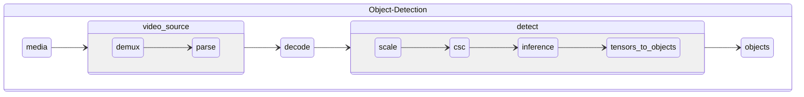
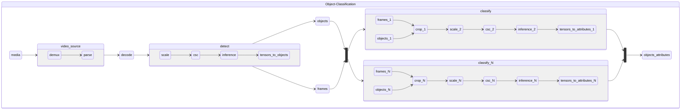
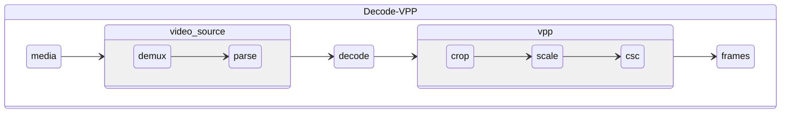

# Tasks and Pipelines

Pipelines are organized according to the task they perform. Tasks are
defined based on the types of input they accept and the types of
output they generate. They specify the overall general topology of a
pipeline. Pipelines within a task further specficy the model,
algorithms and media formats used to perform a task. Each pipeline has
well defined semantics that can be used to compare the performance and
accuracy of different implementations and platforms. 

## Pipeline Taxonomy

## [Object Detection](../pipelines/video/object-detection)

Object detection pipelines take encoded video frames and produce bounding boxes of regions of interest and corresponding labels.

## [Object Classification](../pipelines/video/object-classification)
Object classification pipelines take encoded video frames and produce bounding boxes of regions of interest with labels and attributes.
Object classification pipelines include a detection model and one or multiple classification models.

## [Decode VPP](../pipelines/video/decode-vpp)

Decode VPP pipelines take encoded video frames and produce raw frames
after performing crop, scale and color space conversion.

