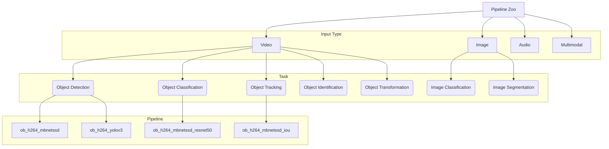

# pipelines

This repository stores pipelines and links to benchmark results.

## Pipeline Taxonomy

## Directory Structure

Each pipeline directory is meant to be standalone and consists of:

* Generic Pipeline Description
* Model Downloader Config
* Sample Media Downloader Config
* Subdirectories for each supported framework:
  * DLStreamer
    * DLStreamer App Configuration
  * FFmpeg
  * TBD

The table below provides pipeline benchmark results. 
* 'Pipeline' column provides a link to the pipeline folder. 
* 'System' column provides a link to Intel Edge Dev Cloud where the benchmark numbers can be reproduced.
* Benchmark results are at 30 FPS for FP32 and INT8 models. Interval column specifies an interval between inference requests. An interval of 1 performs inference on every frame. An interval of 2 performs inference on every other frame. An interval of N performs inference on every Nth frame.

<table>
    <tr>
        <th rowspan=2>Pipeline</th>
        <th rowspan=2>Framework</th>
        <th rowspan=2>Media Properties</th>
        <th rowspan=2>Analytics Properties</th>
        <th rowspan=2>System</th>
        <th align=center, colspan=3>Benchmark Results</th>
    </tr>
        <th aligh=left>Interval</th>
        <th align=left>FP32</th>
        <th align=left>INT8</th>
    </tr>
    <tr>
        <td rowspan=2><a href=https://gitlab.devtools.intel.com/video-analytics/gst-video-analytics/-/tree/master/samples%2Fgst_launch%2Fface_detection_and_classification>Face detection</a></td>
        <td rowspan=2>DLStreamer</td>
        <td rowspan=2>H264 (Main)</td>
        <td rowspan=2>Uniform: 4 faces per frame</td>
        <td rowspan=2><a href=https://software.intel.com/en-us/devcloud/edge>Intel&reg; Xeon&reg; Silver 4216R</a></td>
        <td align=center>1</td>
        <td>29</td>
        <td>74</td>
    </tr>
    <tr>
        <td align=center>2</td>
        <td>53</td>
        <td>104</td>
    </tr>
</table>