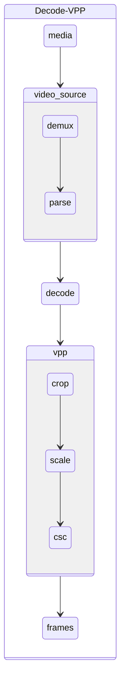

# Decode VPP

Decode VPP pipelines take encoded video frames and produce raw frames
after performing crop, scale and color space conversion.

```mermaid
stateDiagram
    state Decode-VPP {
    state video_source {
		demux --> parse 
    }
	
	state vpp {
		crop --> scale
		scale --> csc
	}
	
	media --> video_source
    video_source --> decode
    decode --> vpp
	vpp --> frames
} 
```

