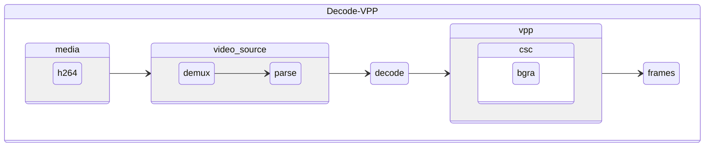

# decode-h264-bgra

Decode VPP  pipeline taking encoded video frames in h264 format, decoding and converting to bgra frames.

```mermaid
stateDiagram
    direction LR
    state Decode-VPP {
	direction LR
	state media {
	direction LR
	h264
	}
	
    state video_source {
	direction LR
		demux --> parse 
    }
	
	state vpp {
	direction LR
	state csc {
	direction LR
		bgra
	}
	}
	
	media --> video_source
    video_source --> decode
    decode --> vpp
	vpp --> frames
} 
```

