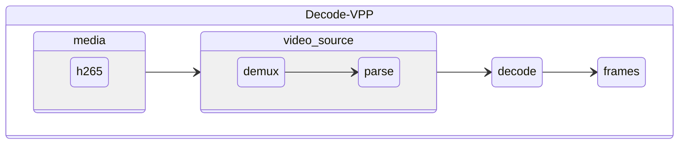

# decode-h265

Decode VPP  pipeline taking encoded video frames in h265 format and decoding them.

```mermaid
stateDiagram
    direction LR
    state Decode-VPP {
	direction LR
	state media {
	direction LR
	h265
	}
	
    state video_source {
	direction LR
		demux --> parse 
    }
		
	media --> video_source
    video_source --> decode
    decode --> frames
} 
```

