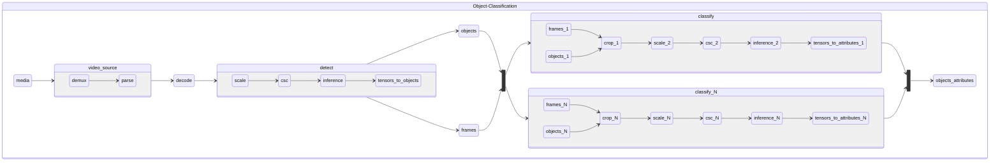

# Object Classification

Object classification pipelines take encoded video frames and produce bounding boxes of regions of interest with labels and attributes.
Object classification pipelines include a detection model and one or multiple classification models.

