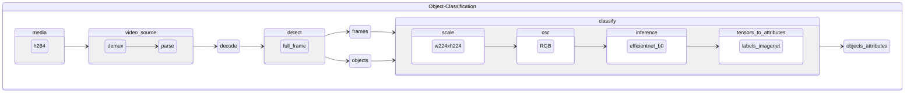

# oc-h264-full_frame-efficientnet-b0

Object classification pipeline taking encoded video frames in h264 format and using [efficientnet-b0](https://github.com/openvinotoolkit/open_model_zoo/tree/master/models/public/efficientnet-b0) for full frame classification.

