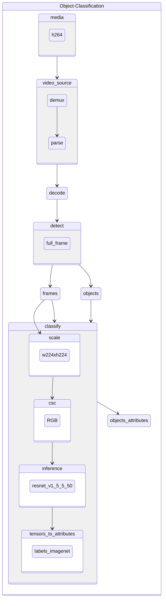

# oc-h264-full_frame-resnet_v1.5_50

Object classification pipeline taking encoded video frames in h264 format and using [resnet_v1.5_50]() for full frame classification.

```mermaid
stateDiagram
 
    state Object-Classification {
  
    state media {
		h264
    }

    state video_source {
		demux --> parse 
    }
frames
objects
state detect {
  full_frame
}
state classify {
    state scale {
      w224xh224
    }
    state csc {
    RGB
    }

    state inference {
    resnet_v1_5_5_50
    }

    state tensors_to_attributes {
    labels_imagenet
    }
        frames --> scale 
		scale --> csc
		csc --> inference
		inference --> tensors_to_attributes
    }
    
    media --> video_source
    video_source --> decode
    decode --> detect
	detect --> objects
	detect --> frames
	frames --> classify
	objects --> classify
    classify --> objects_attributes
} 
```
