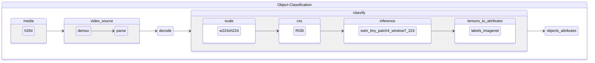

# oc-h264-full_frame-swin-tiny-patch4-window7-224

Object classification pipeline taking encoded video frames in h264 format and using [swin-tiny-patch4-window7-224](https://github.com/openvinotoolkit/open_model_zoo/tree/master/models/public/swin-tiny-patch4-window7-224) for full frame classification.

