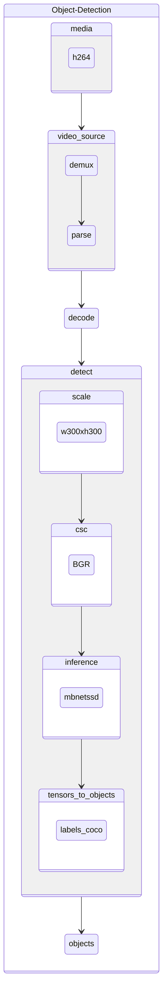

# oc-h264-ssd-mobilenet-v1-coco-resnet-50-tf

Object detection pipeline taking encoded video frames in h264 format and using [ssd-mobilenet-v1-coco]() for detection and [resnet-50-tf]() for classification.

# TODO: Diagram Update

