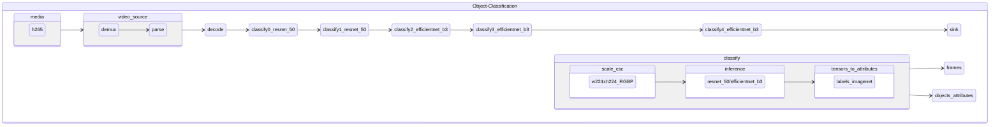

# oc-h265-full_frame-resnet-50-efficientnet-b3

Object full frame classification pipeline taking encoded video frames in h265 format and using [efficientnet-b3, resnet-50-pytorch] for full frame classification.

