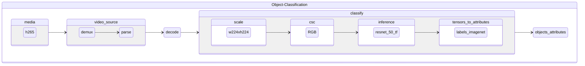

# oc-h265-full_frame-resnet-50-tf

Object classification pipeline taking encoded video frames in h265 format and using [resnet-50-tf](https://github.com/openvinotoolkit/open_model_zoo/tree/master/models/public/resnet-50-tf) for full frame classification.

