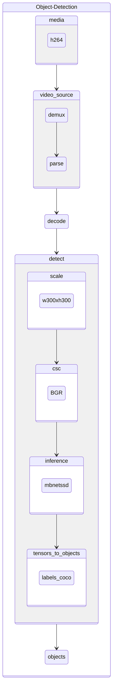

# oc-h265-mbnetssd-v2-coco-resnet_v1.5_50

Object detection pipeline taking encoded video frames in h265 format and using [mobilenet ssd]() for detection and resnet for classification.

# TODO: Update Diagram

