# oc-h265-yolo-v4-tf-416-resnet-50-tf

Object detection pipeline taking encoded video frames in h265 format and using [yolo-v4-tf-416](https://github.com/openvinotoolkit/open_model_zoo/tree/master/models/public/yolo-v4-tf) for detection and [resnet-50-tf](https://github.com/openvinotoolkit/open_model_zoo/tree/master/models/public/resnet-50-tf) for classification.

```mermaid
stateDiagram
    direction LR  
    state Object-Classification {
    direction LR
    state media {
	direction LR
		h265
    }

    state video_source {
	direction LR
		demux --> parse 
    }
frames
objects

    state detect {
	direction LR
    state scale {
	direction LR
      w416xh416
    }
    state csc {
	direction LR
    BGR
    }

    state inference {
	direction LR
    yolo_v4_tf_416
    }

    state tensors_to_objects {
	direction LR
    labels_coco
    }

		scale --> csc
		csc --> inference
		inference --> tensors_to_objects
    }

state classify {
direction LR
    
    state scale_2 {
	direction LR
      w224xh224
    }
    state csc_2 {
	direction LR
    RGB
    }

    state inference_2 {
	direction LR
    resnet_50_tf
    }

    state tensors_to_attributes {
	direction LR
    labels_imagenet
    }
	    frames_1 --> crop
		objects_1 --> crop
	    crop --> scale_2
		scale_2 --> csc_2
		csc_2 --> inference_2
		inference_2 --> tensors_to_attributes
    }
    
    media --> video_source
    video_source --> decode
    decode --> detect
	detect --> objects
	detect --> frames
	frames --> classify
	objects --> classify
    classify --> objects_attributes
} 
```

