# Object Detection Multi

Object Detection Multi pipelines take encoded video frames and produce bounding boxes of regions of interest with labels and attributes.
Object Detection Multi pipelines include a detection model and one or multiple classification models followed by one or multiple detection models.

```mermaid
stateDiagram
    direction LR
    state Object-Detection-Multi {
	direction LR
    state video_source {
	direction LR
		demux --> parse 
    }
	frames
	state classify {
	direction LR
		P: scale_1
		Q: csc_1
		R: inference_1
		frames_1 --> crop_1
		objects_1 --> crop_1
		crop_1 --> P
		P --> Q
		Q --> R
		R --> tensors_to_attributes_1
	}
    
    state detect {
	direction LR
		scale --> csc
		csc --> inference
		inference --> tensors_to_objects
    }
	
	state classify_N {
	direction LR
		frames_N --> crop_N
		objects_N --> crop_N
		crop_N --> scale_N
		scale_N --> csc_N
		csc_N --> inference_N
		inference_N --> tensors_to_attributes_N
	}

	state detect_1 {
	direction LR
		W: scale_1
		X: csc_1
		Y: inference_1
		Z: tensors_to_objects_1
		W --> X
		X --> Y
		Y --> Z
	}

	state detect_N {
	direction LR
		A: scale_N
		B: csc_N
		C: inference_N
		D: tensors_to_objects_N
		A --> B
		B --> C
		C --> D
	}

    state fork <<fork>>
	state join <<join>>
	objects-->fork
	frames-->fork
    media --> video_source
    video_source --> decode
    decode --> detect
    detect --> objects
	detect --> frames
	fork --> classify
	fork --> classify_N
	classify --> join 
	classify_N --> join 
	join --> detect_1
	join --> detect_N
	detect_1 --> objects_attributes
	detect_N --> objects_attributes
} 
```

