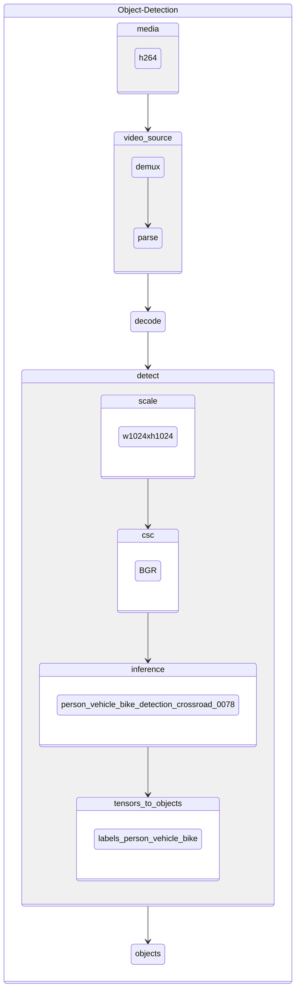

# od-h264-person-vehicle-bike-detection-crossroad

Object detection pipeline taking encoded video frames in h264 format and using [person-vehicle-bike-detection-crossroad]() for detection.

```mermaid
stateDiagram
 
    state Object-Detection {
  
    state media {
    h264
    }

    state video_source {
		demux --> parse 
    }
   
    state detect {
    state scale {
      w1024xh1024
    }
    state csc {
    BGR
    }

    state inference {
	person_vehicle_bike_detection_crossroad_0078
    }

    state tensors_to_objects {
    labels_person_vehicle_bike
    }

		scale --> csc
		csc --> inference
		inference --> tensors_to_objects
    }
    
    media --> video_source
    video_source --> decode
    decode --> detect
    detect --> objects
} 
```
