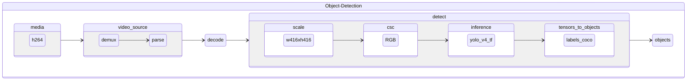

# od-h264-yolo-v4-tf-416

Object detection pipeline taking encoded video frames in h264 format and using [yolo-v4-tf]() for detection.

```mermaid
stateDiagram
    direction LR
    state Object-Detection {
    direction LR
    state media {
    direction LR
    h264
    }

    state video_source {
    direction LR
		demux --> parse
    }

    state detect {
    direction LR
    state scale {
      direction LR
      w416xh416
    }
    state csc {
    direction LR
    RGB
    }

    state inference {
    direction LR
    yolo_v4_tf
    }

    state tensors_to_objects {
    direction LR
    labels_coco
    }

		scale --> csc
		csc --> inference
		inference --> tensors_to_objects
    }

    media --> video_source
    video_source --> decode
    decode --> detect
    detect --> objects
}
```
