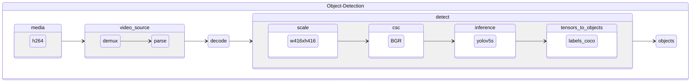

# od-h264-yolov5s-416

Object detection pipeline taking encoded video frames in h264 format and using [yolov5s-416]() for detection.

```mermaid
stateDiagram
    direction LR 
    state Object-Detection {
    direction LR
    state media {
	direction LR
    h264
    }

    state video_source {
	direction LR
		demux --> parse 
    }
   
    state detect {
	direction LR
    state scale {
	direction LR
      w416xh416
    }
    state csc {
	direction LR
    BGR
    }

    state inference {
	direction LR
	yolov5s
    }

    state tensors_to_objects {
	direction LR
    labels_coco
    }

		scale --> csc
		csc --> inference
		inference --> tensors_to_objects
    }
    
    media --> video_source
    video_source --> decode
    decode --> detect
    detect --> objects
} 
```
