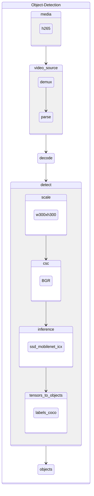

# od-h264-ssd-mobilenet-icx

Object detection pipeline taking encoded video frames in h265 format and using [ssd-mobilenet-icx]() for detection.

```mermaid
stateDiagram
 
    state Object-Detection {
  
    state media {
    h265
    }

    state video_source {
		demux --> parse 
    }
   
    state detect {
    state scale {
      w300xh300
    }
    state csc {
    BGR
    }

    state inference {
    ssd_mobilenet_icx
    }

    state tensors_to_objects {
    labels_coco
    }

		scale --> csc
		csc --> inference
		inference --> tensors_to_objects
    }
    
    media --> video_source
    video_source --> decode
    decode --> detect
    detect --> objects
} 
```
