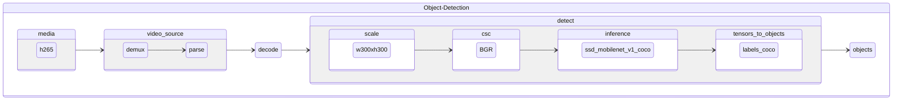

# od-h265-ssd-mobilenet-v1-coco

Object detection pipeline taking encoded video frames in h265 format and using [ssd_mobilenet_v1_coco](https://github.com/openvinotoolkit/open_model_zoo/tree/master/models/public/ssd_mobilenet_v1_coco) for detection.

