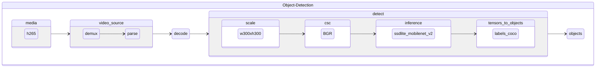

# od-h265-ssdlite-mobilenet-v2

Object detection pipeline taking encoded video frames in h265 format and using [ssdlite_mobilenet_v2](https://github.com/openvinotoolkit/open_model_zoo/tree/master/models/public/ssdlite_mobilenet_v2) for detection.

