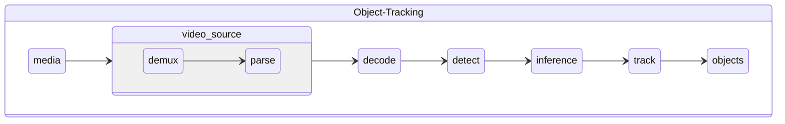

# Object Track

Object tracking pipeline processes decoded video frames scaled to HD resolution, produces detected objects as regions of interest with detection model, generates unique embedding with reidentification model and assign tracking id for each ROI and encodes video stream with HEVC.

