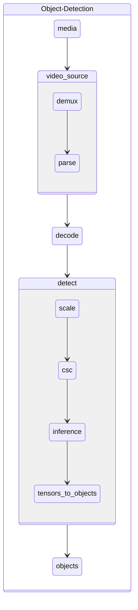

# Object Detection

Object detection pipelines take encoded video frames and produce bounding boxes of regions of interest and corresponding labels.

```mermaid
stateDiagram
 
    state Object-Detection {
  
    state video_source {
		demux --> parse 
    }
   
    state detect {
		scale --> csc
		csc --> inference
		inference --> tensors_to_objects
    }
    
    media --> video_source
    video_source --> decode
    decode --> detect
    detect --> objects
} 
```
