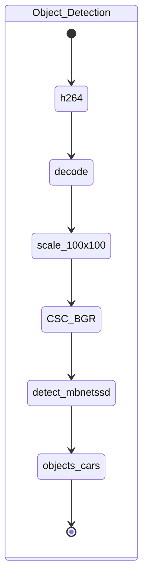

# od-h264-mbnetssd

Object detection pipeline taking encoded video frames in h264 format and using [mobilenet ssd]() for detection.

```mermaid
stateDiagram
    state Object_Detection {
        [*] --> h264
        h264 --> decode
        decode --> scale_100x100
        scale_100x100 --> CSC_BGR
        CSC_BGR --> detect_mbnetssd
        detect_mbnetssd --> objects_cars
        objects_cars --> [*]
    }
   
```
